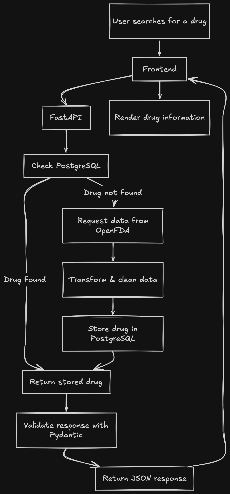

# Drug-Information-Dashboard

A full-stack drug information dashboard that retrieves drug labeling data from the [OpenFDA API], transforms and stores it in PostgreSQL, and serves the data through a FastAPI backend to a React frontend.
The application uses a database-first lookup strategy: if a drug already exists in PostgreSQL, the stored record is returned directly. If it does not exist, the application retrieves the data from OpenFDA, transforms it into a consistent structure, stores it in the database, and returns it to the frontend.

## Project Goal

This project is being built to learn and apply:
- REST APIs
- JSON data handling
- Data extraction and transformation
- PostgreSQL database integration
- Backend API development with FastAPI
- Automated testing with Pytest
- Data visualization

## Features 

- Search for drug information through a React dashboard
- Retrieve drug labeling data from the OpenFDA API
- Transform and clean API responses into a consistent data structure
- Store processed drug information in PostgreSQL
- Query existing drug records before making external API requests
- Serve drug information through a FastAPI REST API
- Handle missing drugs and incomplete API data
- Automated backend and data-pipeline testing with Pytest

## System Architecture

1. The application follows an ETL-oriented architecture:
2. A user searches for a drug through the React frontend
3. The frontend sends the request to the FastAPI backend
4. FastAPI checks PostgreSQL for an existing record
5. If the drug exists, the stored information is returned
6. If the drug does not exist, the application retrieves the drug data from OpenFDA
7. The raw API response is transformed and cleaned
8. The cleaned data is loaded into PostgreSQL
9. The resulting drug information is returned to the frontend and displayed in the dashboard

## Data Pipeline

### Extract 

Drug labeling information is sourced from the OpenFDA API. The application sends a request using the user's drug search and handles unsuccessful API responses, including drugs that cannot be found

### Transform 

The raw OpenFDA JSON response is converted into a consistent application-specific structure. The transformation process extracts relevant fields including:
- Drug name
- Generic name
- Manufacturer
- Purpose
- Active ingredients
- Warnings
- Dosage and administration

Missing or incomplete fields are handled so that the dashboard can display a consistent response

### Load 

Transformed drug information is stored in PostgreSQL. Before making a new OpenFDA request, the application checks whether the requested drug already exists in the database. This reduces unnecessary external API requests and allows previously retrieved information to be served directly from the database.

## Database Schema
- Each row represents one drug retrieved from the OpenFDA API

## API

The backend is built with FastAPI and exposes an endpoint for retrieving drug information.
The API coordinates the database lookup and ETL pipeline, returning cleaned drug information as JSON.
The API also returns an appropriate 404 response when the requested drug cannot be found.

## Frontend 

The dashboard is built with React and provides the user interface for searching and viewing drug information.
The frontend communicates with the FastAPI backend rather than directly accessing the OpenFDA API or PostgreSQL database.

## Tech Stack

| Layer           | Technology      |
| --------------- | --------------- |
| Frontend        | React, Vite     |
| Backend         | Python, FastAPI |
| Data source     | OpenFDA API     |
| Database        | PostgreSQL      |
| HTTP requests   | Requests        |
| Testing         | Pytest          |
| Data format     | JSON            |
| Version control | Git / GitHub    |

## Testing 

The project uses Pytest to test the data pipeline and backend behavior
- Tests cover:
- Drug data transformation
- Missing and empty API fields
- API error handling
- Database insertion
- Database retrieval
- Database misses
- Mocked OpenFDA API requests
- Ensuring the API is not called when a drug already exists in the database
- Ensuring the API is called once when a database lookup fails
- Verifying transformed data is passed correctly to the database-loading function

External API calls are mocked where appropriate so that tests remain deterministic and do not depend on the availability of OpenFDA

## Running Locally 

### Backend 

Install the Python dependencies and configure a local PostgreSQL database
Start the FastAPI application with:
  uvicorn main:app --reload
The backend will run locally on:
  http://localhost:8000

### Frontend 

Navigate to the frontend directory:
  cd frontend
Install the JavaScript dependencies:
  npm install
Start the development server:
  npm run dev
The dashboard will be available at:
  http://localhost:5173

### Future Enhancements
- [ ] Track drug search history
- [ ] Add analytics on searched drugs
- [ ] Add drug comparison functionality
- [ ] Add scheduled data updates
