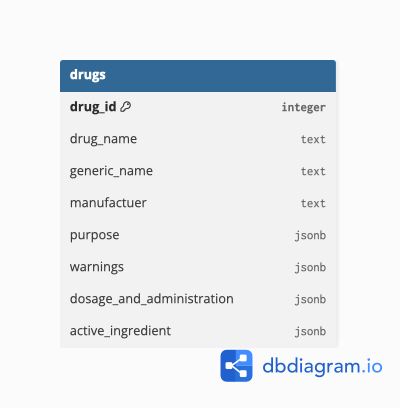

# Drug-Information-Dashboard

A Python backend application that retrieves, transforms, stores, and serves drug information using the OpenFDA API and PostgreSQL. A dashboard will eventually consume the backend API to display drug information.

## Project Goal

This project is being built to learn and apply:
- REST APIs
- JSON data handling
- Data extraction and transformation
- PostgreSQL database integration
- Backend API development with FastAPI
- Automated testing with Pytest
- Data visualization

## Architecture

The application follows an ETL-style pipeline with a REST API layer:

```text
User / Dashboard
       |
       v
   FastAPI API
       |
       v
   PostgreSQL
       |
       |-- Drug exists --> Return stored data
       |
       |-- Drug missing
               |
               v
          OpenFDA API
               |
               v
          Transform data
               |
               v
        Store in PostgreSQL
               |
               v
          Return drug data
~~~

## Project Progress

### API Integration (Extract)
- [x] Install and configure `requests` library
- [x] Connect Python application to OpenFDA API
- [x] Send API requests using drug name as input
- [x] Understand OpenFDA API endpoints and query parameters
- [ ] Handle API response status codes
- [x] Retrieve and inspect raw JSON responses
- [ ] Save raw API responses for future processing

### Data Transformation (Transform)
- [x] Explore OpenFDA JSON structure
- [x] Identify relevant drug information fields
- [x] Extract important fields:
  - [x] Drug name
  - [x] Generic name
  - [x] Manufacturer
  - [x] Purpose
  - [x] Active ingredients
  - [x] Warnings
- [x] Handle missing or incomplete data
- [x] Clean and format extracted information
- [x] Create reusable data transformation functions

### Data Storage (Load)
- [x] Design a data storage structure
- [x] Store cleaned drug information
- [x] Create database tables for drug information
- [x] Insert transformed API data into database
- [x] Query stored drug information

## Database Schema
- Each row represents one drug retrieved from the OpenFDA API


## Dashboard Development
- [ ] Design dashboard layout
- [ ] Create user input for drug searches
- [ ] Connect dashboard to API pipeline
- [ ] Display cleaned drug information
- [ ] Add error messages for invalid searches
- [ ] Improve dashboard usability and formatting

## API Development 
- [x] Create FastAPI application
- [x] Create drug lookup endpoint
- [x] Connect API endpoint to database and ETL pipeline
- [x] Return cleaned drug information as JSON
- [x] Return 404 response when drug cannot be found
- [x] Test successful API requests
- [x] Test unsuccessful API requests

## Testing 
- Transformation function tested using Pytest
- Fake API response objects to verify extracted fields
- Updated transformation function tested to verify error catching
- Added missing/empty key handling
- Test loading into postgres 
- Test retrieving drug in database and drug not in database
- Mocked the OpenFDA API to test the database-miss path without making real API requests
- Verified that the API is not called when the requested drug already exists in the database
- Verified that the API is called exactly once with the requested drug name when the drug is not in the database
- Mocked load_drug() to verify that the cleaned API data is passed to the database-loading function correctly

### Future Enhancements
- [ ] Track drug search history
- [ ] Add analytics on searched drugs
- [ ] Add drug comparison functionality
- [ ] Add scheduled data updates
